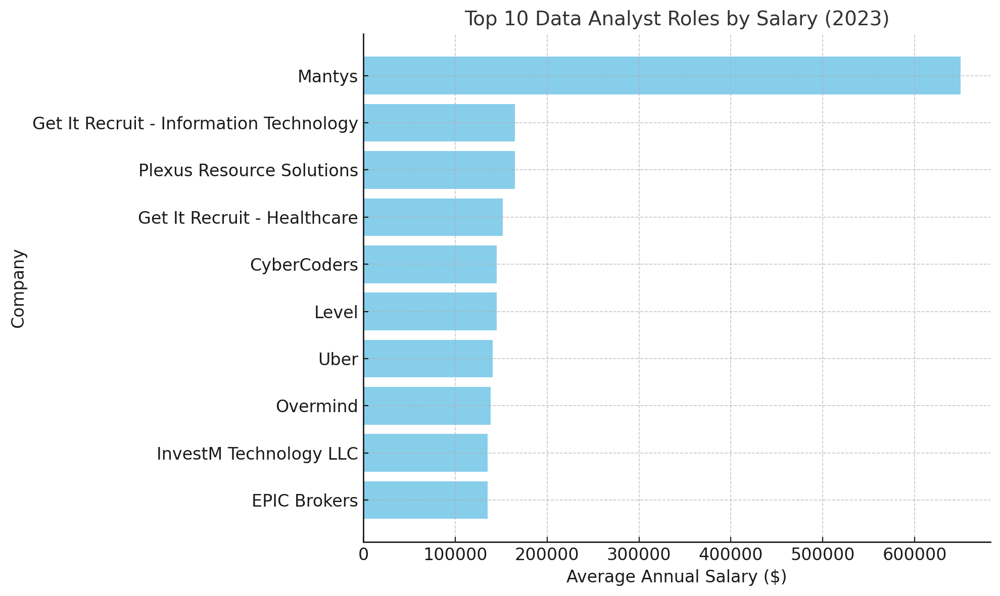
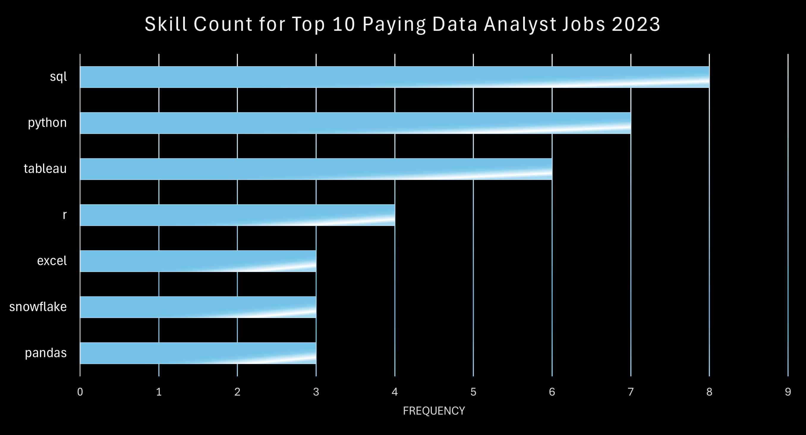

# Exploring the Data Analyst Job Market
#
# Introduction

📊 This project is my deep dive into the data analyst job market. By focusing on data analyst roles, I analyzed 💰 top-paying jobs, 🔥 in-demand skills, and 📈 where high demand meets high salaries, offering a roadmap for aspiring analysts like myself to optimize their career growth.

🔍 Curious about my SQL queries? You’ll find them the: [project_sql folder](/project_sql/)


# Background

Motivated by a desire to better understand the data analyst job market, I embarked on this project as part of my [SQL for Data Analytics Course](https://www.lukebarousse.com/sql). My goal was to uncover insights into the top-paying jobs, the most in-demand skills, and the optimal skills to learn to maximize career opportunities.

The dataset, provided during the course, included job titles, salaries, locations, and skills. 

### Using SQL, I sought to answer these key questions about data analyst roles:

1. What are the top-paying data analyst jobs?
2. What skills are required for these top-paying jobs?
3. What are the most in-demand skills for data analysts?
4. What skills are associated with higher salaries?
5. What are the most optimal skills to learn for a data analyst?

# Tools I Used

For this project, I utilized the following tools to analyze and present my findings:

- **SQL:** My primary tool for querying and analyzing the data.
- **PostgreSQL:** The database management system where the job posting data was stored.
- **Visual Studio Code:** My SQL query execution and database management workspace.
- **Git & GitHub:** For version control, collaboration, and sharing my analysis with others.

# The Analysis

Each query addressed a specific aspect of the data analyst job market. Here’s a summary of my approach and findings:

## 1. Top-Paying Remote Data Analyst Jobs
To identify the highest-paying data analyst roles, I filtered the data by salary, job title, and location, focusing on remote opportunities. Using SQL, I ranked the top 10 roles by salary.

``` SQL 
SELECT
    job_id,
    job_title, 
    job_location, 
    job_schedule_type, 
    salary_year_avg, 
    job_posted_date,
    name AS company_name 
FROM job_postings_fact
LEFT JOIN company_dim ON job_postings_fact.company_id = company_dim.company_id
WHERE
    job_title = 'Data Analyst' AND
    job_location = 'Anywhere' AND
    salary_year_avg IS NOT NULL
ORDER BY
    salary_year_avg DESC
LIMIT 10;
```

*Bar graph visualizing the salary for the top 10 salaries for data analysts and the companies offering them; ChatGPT generated this graph from my SQL query results*

**Findings -**
Here's the breakdown of the top data analyst jobs in 2023:
-  **High Salary:** Salaries for top 10 data analyst roles ranged from $184,000 to $650,000, indicating enormous salary potential in the field.

- **Diverse Employers:** Employers like SmartAsset, Meta, and AT&T offered the highest salaries, demonstrating the interest of various industries in data analyst roles.

- **Remote Options:** The availability of remote work options further emphasizes the high demand for data analysts across multiple industries, as it allows companies to access a wider pool of talent regardless of location.

## 2. Skills for Top-Paying Remote Data Analyst Jobs
In an effort to understand what skills are required for the top-paying jobs, I joined the job postings with the skills data. This query provides insight into what employers value in high-paying roles.

```SQL
WITH top_paying_jobs AS (
    SELECT
        job_id,
        job_title, 
        salary_year_avg, 
        job_posted_date,
        name AS company_name 
    FROM job_postings_fact
    LEFT JOIN company_dim ON job_postings_fact.company_id = company_dim.company_id
    WHERE
        job_title_short = 'Data Analyst' AND
        job_location = 'Anywhere' AND
        salary_year_avg IS NOT NULL
    ORDER BY
        salary_year_avg DESC
    LIMIT 10
)

SELECT 
    top_paying_jobs.*,
    skills 
FROM top_paying_jobs
INNER JOIN skills_job_dim ON top_paying_jobs.job_id = skills_job_dim.job_id
INNER JOIN skills_dim ON skills_job_dim.skill_id = skills_dim.skill_id
ORDER BY
    salary_year_avg DESC;
```

*Bar graph visualizing the count of skills for the top 10 paying jobs for data analysts; I made this graph in Excel based on the data from my SQL query results*

**Findings -** Here's the breakdown of the most demanded skills for the top 10 highest paying data analyst jobs in 2023:

- **SQL** is the most in demand skills with **Python** following closely behind.

- **Tableau** is also highly sought after.

 - Other skills like **R**, **Excel**, **Snowflake**, and **Pandas**, show varying degrees of demand.

## 3. Most In-Demand Skills for Remote Data Analysts
To identify the skills most frequently requested in job postings, I grouped the data by skill and counted its occurrences.

```SQL
SELECT
  skills,
  COUNT(skills_job_dim.job_id) AS demand_count
FROM
  job_postings_fact
INNER JOIN skills_job_dim ON job_postings_fact.job_id = skills_job_dim.job_id
INNER JOIN skills_dim ON skills_job_dim.skill_id = skills_dim.skill_id
WHERE
    job_title_short = 'Data Analyst' AND job_work_from_home = TRUE
GROUP BY
    skills
ORDER BY
    demand_count DESC
LIMIT 5;
```
**Query Results:**

| Skills | Demand Count |
| :---: | :---: |
| SQL | 7291 |
| Excel | 4611 |
| Python | 4330 |
| Tableau | 3745 |
| Power BI | 2609 |

*Table of the demand for the top 5 skills in data analyst job postings*

**Findings -** Here's the breakdown of the most demanded skills for data analysts in 2023:

- **SQL** and **Excel** were foundational, appearing in 7,291 and 4,611 postings, respectively, highlighting the importance of developing skills in data processing and spreadsheet manipulation.

- **Programming Languages** like **Python** and **Visualization Tools** like **Tableau** and **Power BI** were also highly sought after, showing the increasing value of technical skills in data storytelling and decision support.


## 4. Skills Based on Salary for Remote Data Analysts
To identify skills associated with higher salaries, I calculated the average salary for each skill.

```SQL
SELECT
  skills,
  ROUND (AVG (salary_year_avg),2) AS avg_salary
FROM
  job_postings_fact
INNER JOIN skills_job_dim ON job_postings_fact.job_id = skills_job_dim.job_id
INNER JOIN skills_dim ON skills_job_dim.skill_id = skills_dim.skill_id
WHERE
    job_title_short = 'Data Analyst' AND 
    salary_year_avg IS NOT NULL AND
    job_work_from_home = TRUE
GROUP BY
    skills
ORDER BY
    avg_salary DESC
LIMIT 25;
```

**Results of Query:**
| Skills | Avg_Salary |
| :---: | :---: |
| pyspark | 208172.25 |
| bitbucket | 189154.50 |
| couchbase | 160515.00 |
| watson | 160515.00 |
| datarobot | 155485.50 |
| gitlab | 154500.00 |
| swift | 153750.00 |
| jupyter | 152776.50 |
| pandas | 151821.33 |
| elasticsearch | 145000.00 |
| golang | 145000.00 |
| numpy | 143512.50 |
| databricks | 141906.60 |
| linux | 136507.50 |
| kubernetes | 132500.00 |
| atlassian | 131161.80 |
| twilio | 127000.00 |
| airflow | 126103.00 |
| scikit-learn | 125781.25 |
| jenkins | 125436.33 |
| notion | 125000.00 |
| scala | 124903.00 |
| postgresql | 123878.75 |
| gcp | 122500.00 |
| microstrategy | 121619.25 |

*Table of the average salary for the top 25 paying skills for data analysts*

**Findings -** Here's a breakdown of the results for top paying skills for Data Analysts:

This analysis reveals that specific skill sets strongly correlate with higher salaries for data analysts:

- **Big Data & Machine Learning in High Demand:**  Mastery of big data technologies like PySpark and Couchbase, alongside machine learning tools such as DataRobot and Jupyter, commands top salaries. This reflects the industry's high value for professionals capable of handling and deriving insights from large datasets.

- **Software Development Proficiency:**  Knowledge of development tools like GitLab and Jenkins is linked to significantly higher earning potential. This indicates a lucrative overlap between data analysis and software engineering, where automation and efficient data pipeline management are highly sought after.

- **Cloud Computing Expertise:**  Familiarity with cloud platforms and tools like Elasticsearch and GCP is associated with increased salaries, underscoring the growing importance of cloud-based analytics.

- **Specialized Tools & Technologies:**  Proficiency in niche tools like Bitbucket and Watson also contributes to strong earning potential, suggesting that specialized expertise can be highly valuable.

## 5. Most Optimal Skills to Learn for Remote Data Analysts
Finally, I combined insights from demand and salary data to identify skills that are both in high demand and associated with high salaries, offering insight into potential skills to develop.

```SQL
SELECT
    skills_dim.skill_id,
    skills_dim.skills,
    COUNT (skills_job_dim.job_id) AS demand_count,
    ROUND (AVG (job_postings_fact.salary_year_avg), 0) AS avg_salary
FROM
    job_postings_fact
INNER JOIN skills_job_dim ON job_postings_fact.job_id = skills_job_dim.job_id
INNER JOIN skills_dim ON skills_job_dim.skill_id = skills_dim.skill_id
WHERE
    job_title_short = 'Data Analyst' AND 
    salary_year_avg IS NOT NULL AND
    job_work_from_home = TRUE
GROUP BY
    skills_dim.skill_id
HAVING
    COUNT (skills_job_dim.job_id) > 10
ORDER BY
    demand_count DESC, 
    avg_salary DESC
LIMIT 25;

```
**Results of Query:**

| skill_id | skills     | demand_count | avg_salary |
| :---:    | :---:      | :---:        | :---:      |
| 0        | SQL        | 398          | 97237     |
| 181      | Excel      | 256          | 87288     |
| 1        | Python     | 236          | 101397    |
| 182      | Tableau    | 230          | 99288     |
| 5        | R          | 148          | 100499    |
| 183      | Power BI   | 110          | 97431     |
| 7        | SAS        | 63           | 98902     |
| 186      | SAS        | 63           | 98902     |
| 196      | Powerpoint | 58           | 88701     |
| 185      | Looker     | 49           | 103795    |
| 188      | Word       | 48           | 82576     |
| 80       | Snowflake  | 37           | 112948    |
| 79       | Oracle     | 37           | 104534    |
| 61       | SQL Server | 35           | 97786     |
| 74       | Azure      | 34           | 111225    |
| 76       | AWS        | 32           | 108317    |
| 192      | Sheets     | 32           | 86088     |
| 215      | Flow       | 28           | 97200     |
| 8        | Go         | 27           | 115320    |
| 199      | SPSS       | 24           | 92170     |
| 22       | VBA        | 24           | 88783     |
| 97       | Hadoop     | 22           | 113193    |
| 233      | Jira       | 20           | 104918    |
| 9        | JavaScript | 20           | 97587     |
| 195      | Sharepoint | 18           | 81634     |

*Table of the most optimal skills for data analyst sorted by salary*

| Skill Category            | Skills                                      | Avg. Salary | Avg. Demand Count |
| :------------------------ | :------------------------------------------- | :---------: | :----------------: |
| Programming Languages     | SQL, Python, R, SAS, JavaScript, Go, VBA      | 98,456     | 159.86            |
| Data Visualization & BI   | Tableau, Power BI, Looker, Excel, Sheets, PowerPoint, Word | 90,243   | 105.14            |
| Cloud Computing          | Snowflake, Azure, AWS                         | 107,163    | 34.33             |
| Databases                | Oracle, SQL Server, Hadoop                     | 101,741    | 28                 |
| Other                    | SPSS, Jira, Flow, SharePoint                   | 91,722     | 18.25              |

Table classifies skills into categories and lists the average salary and demand count for each skill category. Generated by Google's Gemini.

 **Findings** Here's a breakdown of the most optimal skills for Data Analysts in 2023:

- **Programming Languages:** **SQL** and **Python** stand out as high-demand, high-salary skills for Remote Data Analyst. Their widespread demand and high average salaries indicate strong market value for professionals proficient in these languages.
R, although slightly less in demand than SQL and Python, also falls into the high-demand, high-salary category.

- **Data Visualization & Business Intelligence:** **Tableau** and **Power BI** are high-demand, high-salary skills, reflecting the critical role of data visualization and communication in the modern business world. **Excel**, despite its high demand, has a more moderate salary compared to others on the list.

- **Cloud Computing:**  Skills in cloud platforms like **Snowflake**, **Azure**, and **AWS** are sought after and command highly competitive salaries, reflecting the increasing reliance on cloud-based technologies in the data analysis field.

- **Databases:** Proficiency in traditional databases like **Oracle** and **SQL Server** remains essential and competitive, while **Hadoop** signifies the growing importance of big data technologies and the ability to handle large datasets.

- **Other:** Skills, such as **SPSS**, **Jira**, **Flow**, and **SharePoint**, can be valuable depending on the specific industry and role.

# What I Learned

This project has greatly enhanced my SQL skills. Key takeaways include:

- 🧩 Proficiency in **crafting complex queries** with joins, CTEs, and subqueries.
- 📊 Mastery of **aggregation functions** such as COUNT, AVG, and SUM.
- 💡 **Analytical problem-solving** by translating questions into actionable queries.

# Conclusions

## Insights

Based on the analysis:

1. **Top-Paying Jobs for Remote Data Analyst Jobs:** The highest-paying jobs offer a wide range of salaries (the highest being $650,000) , diverse employers, and job title variety. 

2. **Skills for Top-Paying Remote Analyst Jobs:** High-paying remote data analyst jobs require proficiency in programming such as SQL and Python and Data Visualization tools such as Tableau and Excel. 

3. **Most In-Demand Skills for Remote Data Analysts:** SQL, Excel, Python, Tableau, and Power BI are the most demanded skills in the data analyst job market, thus making it essential for job seekers.

4. **Skills Based on Salary for Remote Data Analysts:** Libraries, such as pyspark, jupyter, and pandas, are associated with the highest average salaries.

5. **Optimal Skills for Remote Data Analysts:** Programming languages and data visulization tools have the most demand on average, but cloud computing and databases have the highest salaries on average. 


## Closing Thoughts
Through this project, I not only strengthened my SQL skills but also gained valuable insights into the competitive data analyst job market. The analysis findings have empowered me to prioritize my skill development and tailor my job search accordingly. This experience underscores the importance of continuous learning and adapting to the ever-changing demands of the data analytics field.
